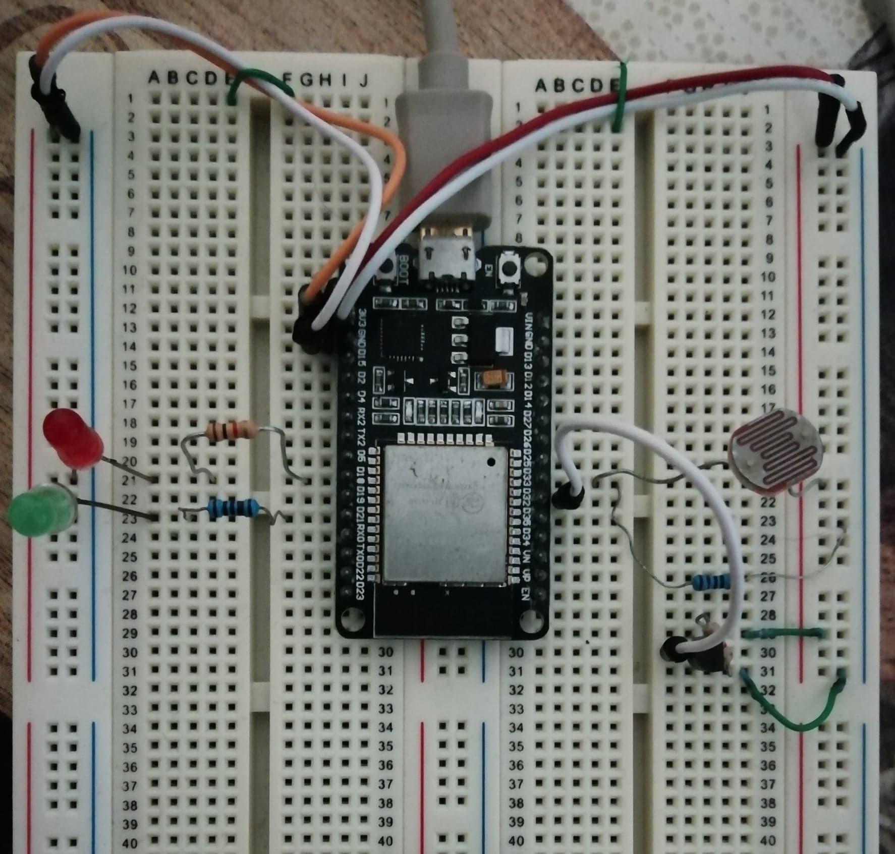
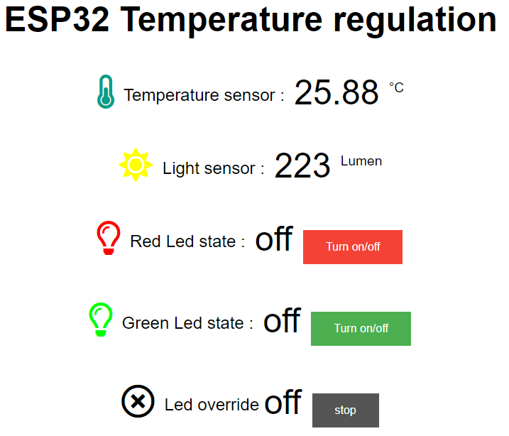
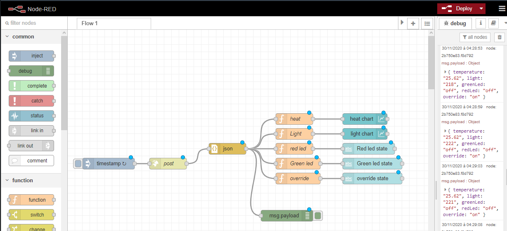
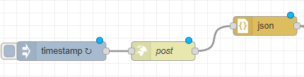
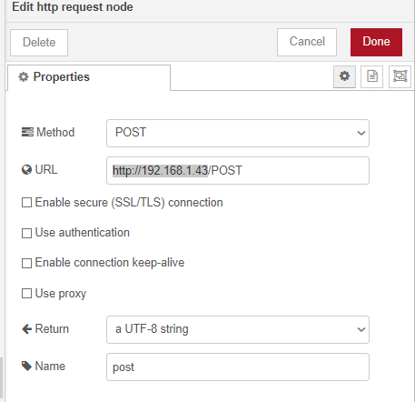
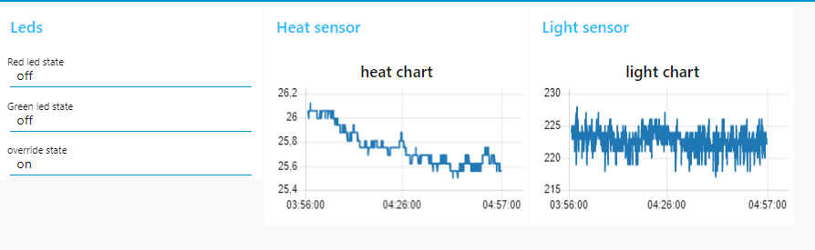

# TODO's SETUPs and steps 

For these TODOs, the ESP32 sensors and leds are setup on :
* Green led : PIN D21
* Red led : PIN D18
* Light sensor (photoresistor) : PIN D33 also called A5
* Heat sensor (DS18B20) : PIN D32

# TODO1 :

# TODO2 : 
A quick guide to set up and run the code of the todo2 on the esp32

## Step zero :
Download all the files and make sure you have node-red on your pc, as well as all the libraries needed.

Node red : https://nodered.org/docs/getting-started/local
We also need the ui palette to be able to have the dashboard with all our led states, heat and light chart.
For that we can use the command "npm install node-red-dashboard"

needed libraries : 
* ESPAsyncWebServer  => https://github.com/me-no-dev/ESPAsyncWebServer

Also need AsyncTCP for the ESP32 => https://github.com/me-no-dev/AsyncTCP

* OneWire            => found in the arduino libraries browser.
* DallasTempperature => found in the arduino libraries browser.
* ArduinoJson        => found in the arduino libraries browser.

## First step : 
Go into the esp_asyncweb folder and modify the classic_setup.ino file.
You need to change the wifi access point's name and password to an availble one.

ex : At line 51 of the file classic_setup.ino

wifiMulti.addAP("GMAP", "vijx4705"); =>  wifiMulti.addAP("MyRouterName", "MyRouterPwd");

## Second step:
Upoad the updated files into the ESP32 from your arduino IDE.

## Third step:
At the start of the ESP32 module, check the serial port output to get your ESP's IP.
This IP will allow you to connect to the ESP web server as a client.

### Using the IP to connect to the ESP server:

Connect to the web server using a browser and the ESP32 IP address.
you should be abble to get this :

You can interact with the leds to set them on and off using the url by passing values.

ex : http://192.168.1.43/?Red_Led_State=off&Green_Led_State=off

there are 3 values you can change: 
* Red_Led_State  (on/off)
* Green_Led_State (on/off)
* override       (on/off)

you can also request the sensors, leds and override state current values by adding the following lines to the link:
* /light
* /temperature
* /redLed
* /greenLed
* /override

( the buttons use the link to set on and off the leds and override status by passing it's value.)

### Using NODE-RED to get a simple interface :

To use node red, open a command terminal and run Node-red. once node-red running, connect to its server using your browser.
Usually the address is shown on the command terminal after it successfully start running.

ex: [info] Server now running at http://localhost:1880/

once connected on node red web server, import the "Simple_Monitoring_NodeRed.json" file by going into the the scroll menu on the upper right corner then choosing "import".

you will get the following node-red "flow" :

You will most likely need to change the ESP IP by double clicking on the post green rectangle

and changing the URL to "[YourEsp32IP]/POST"

Everything should be now okay you only need to deploy this flow by clicking on the "Deploy" button on the upper right of the web page.
To make sure everything got deployed, the blue circles on the different rectangle should be all gone.

Once the deployment done, you can check the data in the debug console or on the dashboard by going to the node red address /ui

ex : http://localhost:1880/ui

